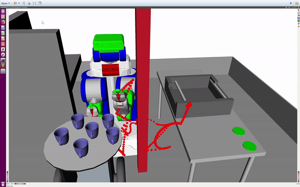

# Motion Planning for a Humanoid Robot Arm

In this project, I implemented multiple sampling based motion planning algorithms (RRT, RRT*, Bidirectional RTT) for a 
humanoid robot to perform grasping tasks, and compared the performances of different methods. The red path is the raw path from the planer, and the blue path is the optimized and smoothed path. 




## Required packages:
 - Openrave
 - Python 2.7
 - Cmake
 
 ## Instruction
To use the RRT method, run 
```python
 python rrt.py
```
